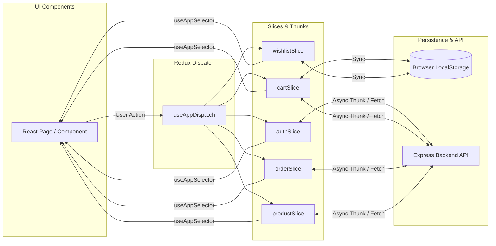

# ShopSphere Frontend Application

[](https://react.dev/)
[](https://www.typescriptlang.org/)
[](https://vitejs.dev/)
[](https://redux-toolkit.js.org/)
[](https://tailwindcss.com/)
[](https://www.framer.com/motion/)
[](https://www.radix-ui.com/)
[](https://sonner.emilkowal.ski/)

---

## Table of Contents

- [Overview & Architecture](#overview--architecture)
- [Technology Stack Matrix (Why & How)](#technology-stack-matrix-why--how)
- [Directory Structure](#directory-structure)
- [State Management Architecture (Redux Toolkit)](#state-management-architecture-redux-toolkit)
- [Routing & Protected Navigation](#routing--protected-navigation)
- [Feature Breakdown & UX Workflows](#feature-breakdown--ux-workflows)
  - [Global Command Search (`Cmd+K`)](#1-global-command-search-cmdk)
  - [Product Discovery & Catalog Filters](#2-product-discovery--catalog-filters)
  - [Shopping Cart & Coupon Engine](#3-shopping-cart--coupon-engine)
  - [Dual Checkout Experience](#4-dual-checkout-experience)
  - [Order Tracking & Tax Invoices](#5-order-tracking--tax-invoices)
  - [Conversational AI Assistant](#6-conversational-ai-assistant)
  - [Administrative Operations Suite](#7-administrative-operations-suite)
  - [Delivery Partner Portal](#8-delivery-partner-portal)
- [Design System & Theme Engine](#design-system--theme-engine)
- [Environment Configuration](#environment-configuration)
- [Local Setup & Scripts](#local-setup--scripts)

---

## Overview & Architecture

The ShopSphere Frontend is a single-page application built on React 19 and TypeScript, designed to deliver instantaneous user interactions, fluid 60 FPS transitions, accessible interface components, and cross-device responsiveness.

```
+-------------------------------------------------------------------------+
|                      React 19 Component Tree Root                       |
+-------------------------------------------------------------------------+
                                     |
                                     v
                  +-------------------------------------+
                  |   Redux Store Provider (store.ts)   |
                  +-------------------------------------+
                                     |
                                     v
                  +-------------------------------------+
                  |   BrowserRouter & Route Interceptor |
                  +-------------------------------------+
                                     |
        +----------------------------+----------------------------+
        |                                                         |
        v                                                         v
+-----------------------------+             +-----------------------------+
|    Public Customer Views    |             |    Protected Portals        |
|  - Home & Hero Banners      |             |  - User Profile & Orders    |
|  - Product Catalog & Detail |             |  - Delivery Partner Hub     |
|  - Cart & Checkout Modals   |             |  - Admin Analytics & CRUD   |
+-----------------------------+             +-----------------------------+
        |                                                         |
        +----------------------------+----------------------------+
                                     |
                                     v
                  +-------------------------------------+
                  |  Shared Overlays: Command Palette,  |
                  |  AI Chatbot, Global Sonner Toaster  |
                  +-------------------------------------+
```

---

## Technology Stack Matrix (Why & How)

| Dependency | Purpose | Why We Chose It | How We Used It |
|---|---|---|---|
| `react` (v19.1) | UI Library | Modern concurrent rendering, enhanced state transitions, and server-component readiness. | Built declarative component hierarchies, form handlers, and animated view containers. |
| `vite` (v7.0) | Build Tool & Bundler | Instant dev server boot, lightning-fast HMR via native ESM, and optimized production builds. | Orchestrated dev serving, asset bundling, PostCSS processing, and environment variables. |
| `typescript` (v5.8) | Static Type Checking | Eliminates type bugs, provides autocomplete, and enforces strict backend API contracts. | Typed Redux states, API payloads, custom hooks, and React component props. |
| `@reduxjs/toolkit` (v2.8) | Centralized State Management | Eliminates boilerplate, integrates Immer for immutable updates, and simplifies async logic. | Configured global slices (`auth`, `cart`, `order`, `product`, `review`, `wishlist`). |
| `tailwindcss` (v4.1) | Design System & Styling | Modern CSS token engine with zero runtime overhead and dynamic utility composition. | Implemented responsive layouts, dark/light theme tokens, and custom glassmorphism styles. |
| `framer-motion` (v12.23) | Motion & Animation Engine | Declarative animation syntax, layout animations, and spring physics. | Animated product card hovers, modal enter/exit transitions, and page fade effects. |
| `@radix-ui/react-*` | Accessible UI Primitives | Headless, unstyled accessible UI components complying strictly with WAI-ARIA standards. | Built accessible dialog modals, dropdown menus, and popovers with focus trapping. |
| `fuse.js` (v7.1) | Client-Side Fuzzy Search | Fast, zero-network fuzzy search algorithm for instant typing feedback. | Powers the global `Cmd+K` / `Ctrl+K` command search modal across product titles and tags. |
| `keen-slider` | Touch-Friendly Carousels | Lightweight, hardware-accelerated carousel with smooth touch gestures. | Powers the Home page promotional banners and related product recommendation sliders. |
| `sonner` (v2.0) | Toast Notification System | Lightweight, customizable notification toasts supporting stacking and action buttons. | Dispatches transactional toasts for cart additions, login confirmations, and errors. |
| `lucide-react` | Icon System | Clean, modern SVG icon set with tree-shakable ES module exports. | Rendered interface icons across navigation bars, buttons, ratings, and dashboard widgets. |

---

## Directory Structure

```
ShopShereF/
|-- src/
|   |-- assets/                          # Static SVG icons and illustrations
|   |-- components/
|   |   |-- admin/                       # Admin management widgets (Tables, Modals)
|   |   |-- chatbot/
|   |   |   `-- Chatbot.tsx              # Floating AI assistant with quick prompts
|   |   |-- common/
|   |   |   |-- CommandSearchModal.tsx   # Global fuzzy search command palette (Cmd+K)
|   |   |   |-- ConfirmModal.tsx         # Accessible confirmation dialog
|   |   |   |-- Loader.tsx               # Centered loading spinner component
|   |   |   |-- ScrollToTop.tsx          # Automated scroll-to-top route listener
|   |   |   `-- Skeletons.tsx            # Animated shimmer loading placeholders
|   |   |-- layout/
|   |   |   `-- Navbar.tsx               # Responsive navigation bar with search & cart
|   |   |-- orders/
|   |   |   `-- OrderTrackingModal.tsx   # Real-time logistics checkpoint stepper
|   |   |-- products/
|   |   |   |-- ProductCard.tsx          # Catalog product card with badges & wishlist
|   |   |   `-- RatingStars.tsx          # Reusable star rating visualization
|   |   |-- reviews/
|   |   |   `-- ReviewFormModal.tsx      # Customer review and rating submission modal
|   |   |-- routes/
|   |   |   |-- AdminRoute.tsx           # Route guard restricted to admin role
|   |   |   `-- ProtectedRoute.tsx       # Route guard restricted to authenticated users
|   |   `-- ui/                          # Custom styled button, badge, and card primitives
|   |
|   |-- data/
|   |   `-- categories.ts                # Static category metadata and hero banners
|   |
|   |-- hooks/
|   |   |-- useDebounce.ts               # Value debouncing hook for search inputs
|   |   `-- useTheme.ts                  # Dark / Light theme detection and toggle hook
|   |
|   |-- lib/
|   |   `-- utils.ts                     # Tailwind class merging (`clsx` + `tailwind-merge`)
|   |
|   |-- pages/
|   |   |-- admin/
|   |   |   |-- AdminCoupons.tsx         # Coupon creator, validator, and management
|   |   |   |-- AdminDashboard.tsx       # Store revenue metrics, orders, growth stats
|   |   |   |-- AdminOrderDetailsPage.tsx# Single order fulfillment & tracking editor
|   |   |   |-- AdminOrders.tsx          # Order management and status transition table
|   |   |   |-- AdminProducts.tsx        # Product catalog CRUD with image uploader
|   |   |   `-- AdminUsers.tsx           # User accounts table and role privileges
|   |   |-- auth/
|   |   |   |-- ForgotPasswordPage.tsx   # Password reset request form
|   |   |   |-- LoginPage.tsx            # Email/Password & Google SSO login
|   |   |   |-- RegisterPage.tsx         # New customer account registration
|   |   |   `-- ResetPasswordPage.tsx    # Token validation and new password entry
|   |   |-- delivery/
|   |   |   `-- DeliveryDashboard.tsx    # Delivery partner hub with route checkpoints
|   |   |-- products/
|   |   |   |-- ProductDetail.tsx        # Product showcase, gallery, reviews, related
|   |   |   `-- Products.tsx             # Filterable catalog with price slider & sorting
|   |   |-- user/
|   |   |   |-- ProfilePage.tsx          # Customer profile and security settings
|   |   |   |-- UserOrders.tsx           # Customer orders, invoice viewer, cancellation
|   |   |   `-- WishlistPage.tsx         # Saved items list with one-click cart transfer
|   |   |-- CartPage.tsx                 # Shopping cart with coupon code simulator
|   |   |-- CheckOut.tsx                 # Shipping address and payment method selector
|   |   |-- Home.tsx                     # Hero banner, featured products, categories
|   |   `-- NotFoundPage.tsx             # 404 error fallback view
|   |
|   |-- redux/
|   |   |-- slices/
|   |   |   |-- authSlice.ts             # User session, JWT state, role permissions
|   |   |   |-- cartSlice.ts             # Cart items, quantities, coupon discount state
|   |   |   |-- orderSlice.ts            # Orders, active order, tracking events
|   |   |   |-- productSlice.ts          # Catalog products, filters, single product
|   |   |   |-- reviewSlice.ts           # Product reviews and rating states
|   |   |   `-- wishlistSlice.ts         # Wishlist items with localStorage persistence
|   |   |-- hooks.ts                     # Typed `useAppDispatch` and `useAppSelector`
|   |   `-- store.ts                     # Root Redux store configuration
|   |
|   |-- types/
|   |   `-- index.ts                     # TypeScript interfaces and contracts
|   |
|   |-- utils/
|   |   |-- api.ts                       # Axios / Fetch client with credential headers
|   |   |-- currency.ts                  # Currency formatting helpers (INR / USD)
|   |   `-- invoice.ts                   # Printable tax invoice generator
|   |
|   |-- App.tsx                          # Master routes declaration and layout shell
|   |-- index.css                        # Tailwind CSS v4 design system and variables
|   `-- main.tsx                         # DOM bootstrapping
|
|-- index.html                           # HTML template
|-- package.json                         # Dependencies and scripts
|-- tsconfig.json                        # TypeScript settings
|-- vite.config.ts                       # Vite configuration
`-- README.md                            # Documentation (This file)
```

---

## State Management Architecture (Redux Toolkit)



### Redux Feature Slices Breakdown

1. **`authSlice`**: Tracks authenticated user object, authentication status (`idle`, `loading`, `authenticated`), and role permissions (`admin`, `delivery`, `user`).
2. **`cartSlice`**: Tracks cart items, item quantities, active promo coupon, calculated discount values, and checkout subtotal.
3. **`wishlistSlice`**: Tracks favorited product IDs and items with continuous synchronization to `localStorage`.
4. **`productSlice`**: Manages fetched products, active category filter, price slider bounds, sorting order, pagination metadata, and single product view.
5. **`orderSlice`**: Manages current user orders, active selected order for tracking, and administrative order lists.
6. **`reviewSlice`**: Manages product reviews, submitted ratings, and user review eligibility.

---

## Routing & Protected Navigation

```
+-------------------------------------------------------------------------+
|                        Application Route Hierarchy                      |
+-------------------------------------------------------------------------+
| Path                       | View Component         | Access Guard      |
+----------------------------+------------------------+-------------------+
| /                          | Home.tsx               | Public            |
| /products                  | Products.tsx           | Public            |
| /products/:id              | ProductDetail.tsx      | Public            |
| /cart                      | CartPage.tsx           | Public            |
| /login                     | LoginPage.tsx          | Guest Only        |
| /register                  | RegisterPage.tsx       | Guest Only        |
| /forgot-password           | ForgotPasswordPage.tsx | Guest Only        |
| /reset-password/:token     | ResetPasswordPage.tsx  | Guest Only        |
| /checkout                  | CheckOut.tsx           | Authenticated     |
| /profile                   | ProfilePage.tsx        | Authenticated     |
| /orders                    | UserOrders.tsx         | Authenticated     |
| /wishlist                  | WishlistPage.tsx       | Public / Auth     |
| /delivery                  | DeliveryDashboard.tsx  | Delivery / Admin  |
| /admin                     | AdminDashboard.tsx     | Admin Only        |
| /admin/products            | AdminProducts.tsx      | Admin Only        |
| /admin/orders              | AdminOrders.tsx        | Admin Only        |
| /admin/orders/:id          | AdminOrderDetailsPage  | Admin Only        |
| /admin/users               | AdminUsers.tsx         | Admin Only        |
| /admin/coupons             | AdminCoupons.tsx       | Admin Only        |
| *                          | NotFoundPage.tsx       | Public            |
+-------------------------------------------------------------------------+
```

---

## Feature Breakdown & UX Workflows

### 1. Global Command Search (`Cmd+K`)
- **Keyboard Shortcut**: Press `Cmd+K` (macOS) or `Ctrl+K` (Windows/Linux) from any screen to open the global search modal.
- **Fuzzy Matching**: Powered by Fuse.js with weighted indexing across product names, categories, and tags.
- **Direct Navigation**: Use arrow keys and Enter to immediately view the selected product.

### 2. Product Discovery & Catalog Filters
- **Interactive Price Slider**: Dynamic range slider filtering products within exact budget constraints.
- **Rating Filters**: Filter products by minimum customer ratings (1+ to 5 stars).
- **Category Filter Pills**: Quick toggle chips for instant category filtering.
- **Sorting Engine**: Sort items by Price (Low to High / High to Low), Newest Arrivals, or Highest Rated.

### 3. Shopping Cart & Coupon Engine
- **Quantity Adjustments**: Real-time increment and decrement controls with stock boundary protection.
- **Coupon Validation**: Test promo codes (e.g. `SHOPSHERE10`, `FLAT500`) with immediate subtotal and discount feedback.
- **Persistent Storage**: Cart contents persist across page refreshes and synchronize with the database upon user login.

### 4. Dual Checkout Experience
- **Razorpay Checkout**: Seamless payment modal processing UPI, Debit/Credit Cards, Net Banking, and Wallets with cryptographic verification.
- **Instant Demo / COD Checkout**: Complete end-to-end order placement and invoice generation without third-party payment dependencies.

### 5. Order Tracking & Tax Invoices
- **4-Step Visual Stepper**: Displays live package status (`Placed` -> `Processing` -> `Shipped` -> `Delivered`).
- **Logistics Timeline**: Chronological tracking events detailing exact locations, timestamps, and courier notes.
- **Printable Tax Invoices**: Downloadable and printable invoice view containing buyer/seller tax details, line items, discounts, and order IDs.

### 6. Conversational AI Assistant
- Floating bottom-right chatbot with support for general shopping queries, order tracking, and store policies.
- Powered by Groq LLaMA 3 with intelligent offline rule-based fallback.

### 7. Administrative Operations Suite
- **Analytics Dashboard**: Metric cards for Total Revenue, Total Orders, Active Users, and Product Count.
- **Catalog Management**: Full CRUD interface for adding, updating, and deleting products with multipart image uploads.
- **Order Fulfillment**: Update shipment stages (`shipped`, `out_for_delivery`, `delivered`) and view complete buyer details.
- **Coupon Manager**: Create, modify, and expire discount codes with minimum spend and category rules.
- **User Roles**: Promote or demote user permissions across Customer, Delivery Agent, and Admin roles.

### 8. Delivery Partner Portal
- **Dispatch List**: Dedicated dashboard for delivery executives listing packages awaiting transit or delivery.
- **Live Checkpoints**: Add real-time transit checkpoints, location updates, and delivery notes.
- **Proof of Delivery**: Mark orders as delivered to finalize the order lifecycle.

---

## Design System & Theme Engine

ShopSphere uses Tailwind CSS v4 paired with CSS custom properties to ensure seamless dark and light mode rendering:

```css
:root {
  --bg-primary: #ffffff;
  --bg-secondary: #f8fafc;
  --text-primary: #0f172a;
  --text-secondary: #64748b;
  --accent-primary: #2563eb;
  --border-color: #e2e8f0;
}

[data-theme='dark'] {
  --bg-primary: #0f172a;
  --bg-secondary: #1e293b;
  --text-primary: #f8fafc;
  --text-secondary: #94a3b8;
  --accent-primary: #3b82f6;
  --border-color: #334155;
}
```

---

## Environment Configuration

Create a `.env` file in the `ShopShereF` root directory:

```env
# Backend REST API Base URL
VITE_API_BASE_URL=http://localhost:5000/api

# Razorpay Client Key (Optional: Demo mode enabled when omitted)
VITE_RAZORPAY_KEY_ID=your_razorpay_key_id

# Google OAuth 2.0 Client ID (Optional for Google SSO)
VITE_GOOGLE_CLIENT_ID=your_google_oauth_client_id
```

---

## Local Setup & Scripts

```bash
# 1. Install Dependencies
npm install

# 2. Launch Vite Development Server (with HMR)
npm run dev

# 3. Lint Source Code
npm run lint

# 4. Create Production Build
npm run build

# 5. Preview Production Bundle Locally
npm run preview
```
The application will be available at `http://localhost:5173`.
